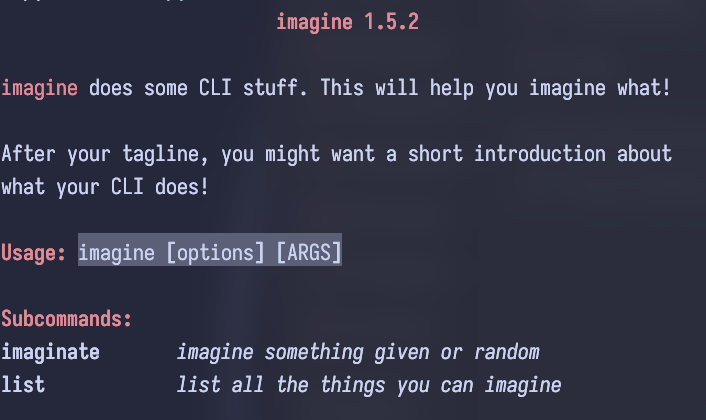

<i><b>assistance in times of hardship and distress</b></i>

`succour` is a help printer for Rust which provides beautiful, compact, width aware output. It isn't January 1st, 1970 anymore. Why are we still printing help like it is? 

It primarily aims to be compatible with clap, but work on supporting other argument parsers through feature flags is ongoing.

---

**Simple when necessary**

By default `succour` prints a slightly nicer version of the default clap help output with only minor enhancements and changes
that should work on any terminal emulator. This ensures an 
easy transition from clap and widespread compatibility. Most features and enhancements are opt-in, not opt-out.

The goal of `succour` is to become *the* help printer for Rust, even over those included with argparsers. This means that 
simplicity and ease-of-use are the name of the game. However, complexity is possible when needed. `succour` works from 
simple multi flag programs to those with multiple nested subcommands.

**Highly customizable**

`succour` offers significant customisation. This ranges from the ability to customise output colours to the ability to add tables, sections 
for things like usage examples, and highlight certain phrases. 

Despite all this complexity, it still respects the difference between short and long help. It also allows for user experience improvements, 
such as a preview of the flags a subcommand takes without entering its subhelp.

**Final note: I'm aware this README is very full of itself. Thank you for putting up with it.**
